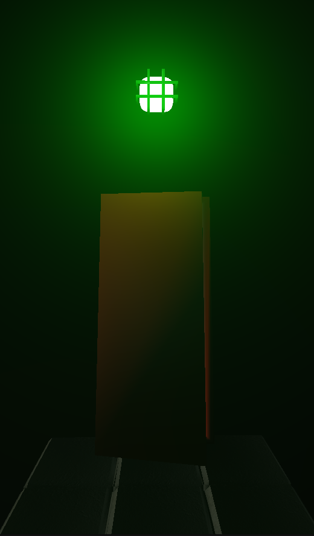
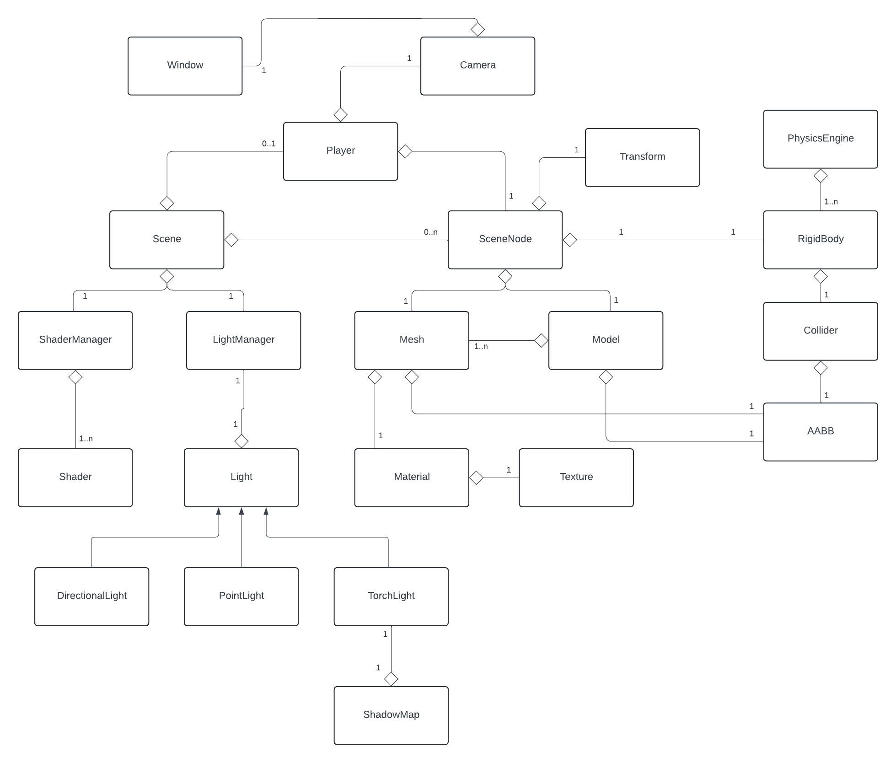
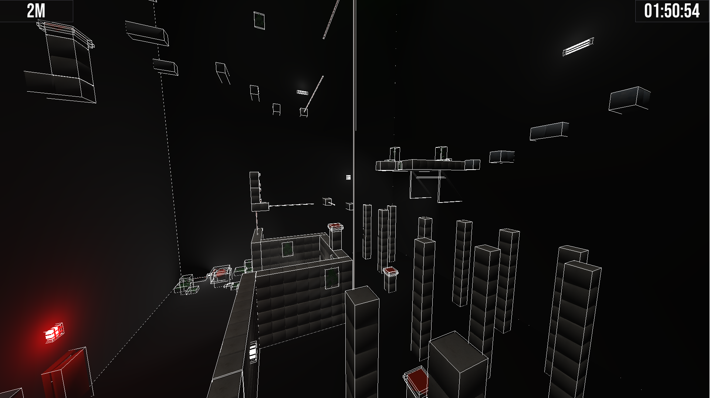
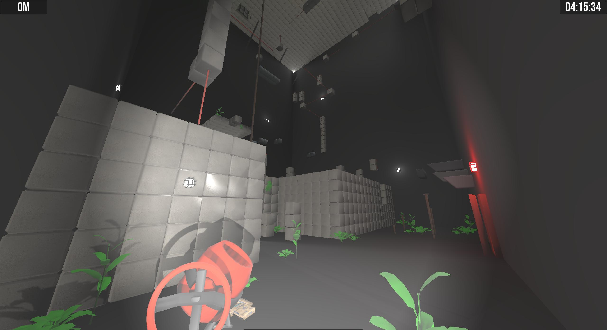
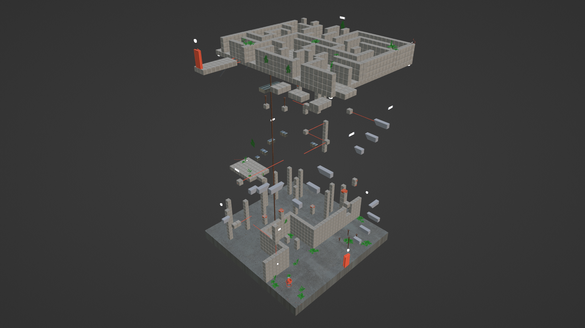
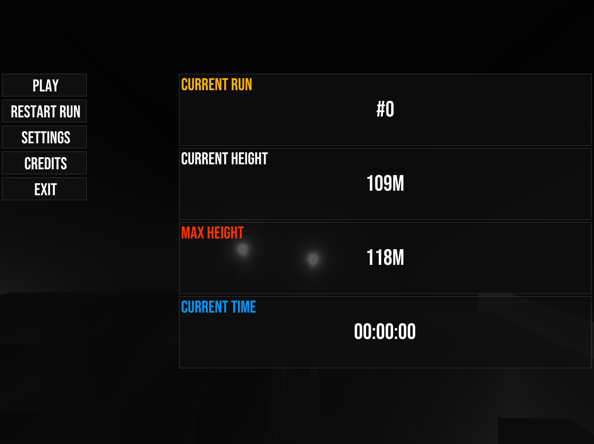
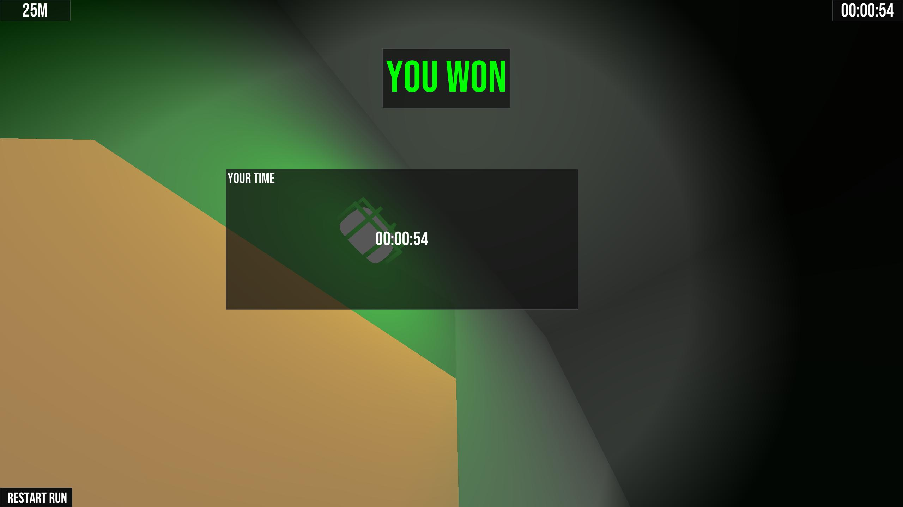
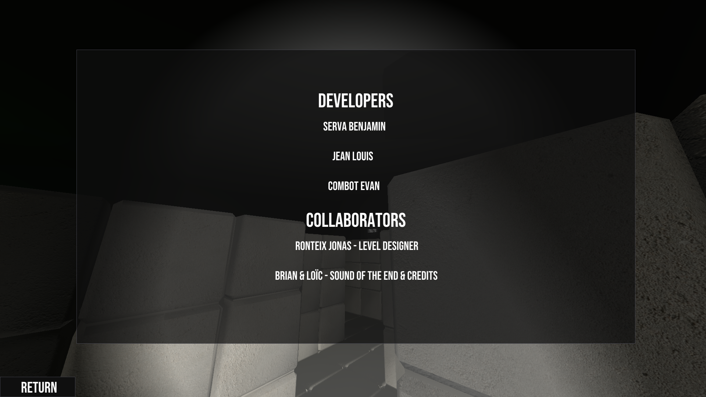

# Ciment Doux

<div align="center">
   
</div>

**Ciment Doux** is a first-person platformer video game, inspired by the brutalist parkour game [*Beton Brutal*](https://store.steampowered.com/app/2330500/BETON_BRUTAL), created to demonstrate a custom 3D game engine. The engine was developed from the ground up in C++ and OpenGL as part of the IMAGINE Computer Graphics Master's program at the University of Montpellier.

For a detailed technical breakdown, please see our [full project report (in French)](RapportCimentDoux.pdf).

## Key engine features

- **3D rendering pipeline:** a complete rendering system built on modern OpenGL.
- **3D model loading:** integration of the **Assimp** library to load and render complex 3D models.
- **Physics and collision:** an AABB-based collision detection system for player and environment interactions.
- **In-game UI:** a game menu and interface built with **ImGui** for settings and interactions.
- **Core technical stack:** built upon a robust foundation using **GLFW** for windowing, **GLAD** for OpenGL function loading, and **GLM** for mathematics.

## Engine architecture

<div align="center">
   
   
</div>

## In-game screenshots

<div align="center">
   
   
</div>
<div align="center">
  
  
</div>

## Build & run instructions

### 1. Clone the repository
```bash
git clone git@github.com:louis-jean0/CimentDoux.git
```

### 2. Compile
```bash
mkdir build
cd build
cmake ..
make
```

### 3. Run the game
```bash
./main 
```

## Controls

- **WASD / ZQSD**: move (can be switched in the menu)
- **Mouse Movement**: look around
- **Spacebar**: jump
- **Left Shift**: sprint
- **Left Click**: cycle flashlight power
- **Right Click**: toggle flashlight On/Off
- **R**: restart the game
- **Escape**: open the menu

## Troubleshooting

- If you are using a lower-spec machine, we recommend replacing the `src/scene.cpp` file with `ordi_lent/scene.cpp`.
- If you encounter issues with `glm` during compilation, replace `CMakeLists.txt` with `ordi_lent/CMakeLists.txt`.

## License

This project is licensed under the MIT License - see the [LICENSE](LICENSE) file for details.

## Authors

<div align="center">
   
</div>

---

<details>
<summary>🇫🇷 Version française</summary>

# Ciment Doux

<div align="center">
   
</div>

**Ciment Doux** est un jeu vidéo de type platformer à la première personne, inspiré du jeu de parkour brutaliste [*Beton Brutal*](https://store.steampowered.com/app/2330500/BETON_BRUTAL), conçu comme une démonstration pour un moteur de jeu développé en C++ et OpenGL. Le moteur a été réalisé dans le cadre de notre master d'Informatique parcours IMAGINE à l'Université de Montpellier.

Pour plus d'informations, veuillez consulter notre [rapport de projet](RapportCimentDoux.pdf).

## Fonctionnalités clés du moteur

- **Pipeline de rendu 3D:** un système de rendu complet basé sur OpenGL moderne.
- **Chargement de modèles 3D:** intégration de la bibliothèque **Assimp** pour charger et afficher des modèles 3D complexes.
- **Physique et collisions:** un système de détection de collision basé sur des AABB pour les interactions entre le joueur et l'environnement.
- **Interface en jeu:** un menu et une interface construits avec **ImGui** pour les réglages et interactions.
- **Socle technique:** bâti sur une fondation robuste utilisant **GLFW** pour la gestion de la fenêtre, **GLAD** pour le chargement des fonctions OpenGL, et **GLM** pour les mathématiques.

## Architecture du moteur

<div align="center">
   
   
</div>

## Captures d'écran du jeu

<div align="center">
   
   
</div>
<div align="center">
  
  
</div>

## Instructions pour la compilation et l'exécution

### 1. Cloner le dépôt
```bash
git clone git@github.com:louis-jean0/CimentDoux.git
```

### 2. Compiler
```bash
mkdir build
cd build
cmake ..
make
```

### 3. Lancer le jeu
```bash
./main 
```

## Contrôles

- **Z,Q,S,D** ou **W,A,S,D**: se déplacer (modifiable dans le menu)
- **Mouvements de la souris**: bouger la vue
- **Espace**: sauter
- **Shift gauche**: courir
- **Clic gauche**: changer la puissance de la lampe-torche
- **Clic droit**: allumer/éteindre la lampe-torche
- **R**: recommencer la partie
- **Échap**: ouvrir le menu

## Problèmes potentiels

- Si votre ordinateur n'est pas très performant, nous vous conseillons de remplacer le fichier `src/scene.cpp` par `ordi_lent/scene.cpp`.
- Si vous rencontrez des problèmes avec `glm` lors de la compilation, remplacez `CMakeLists.txt` par `ordi_lent/CMakeLists.txt`.

## Licence

Ce projet est sous licence MIT - consultez le fichier [LICENSE](LICENSE) pour plus de détails.

## Auteurs

<div align="center">
   
</div>

</details>
