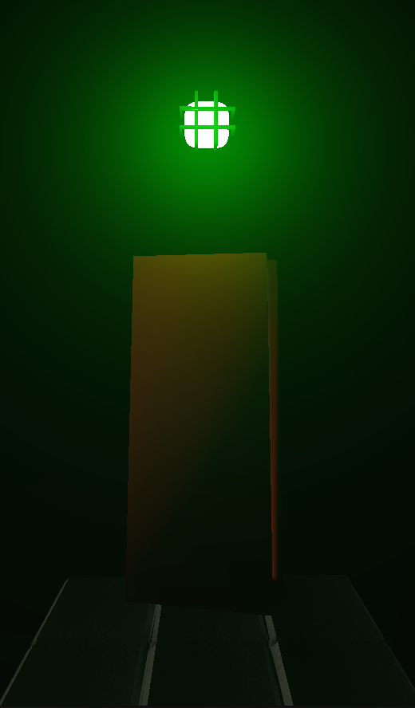

# Ciment Doux

<div align="center">
   
</div>

**Ciment Doux** est un jeu vidéo de type platformer à la première personne, conçu comme une démonstration pour un moteur de jeu développé en C++ et OpenGL dans le cadre de notre master d'Informatique parcours IMAGINE à l'Université de Montpellier. Ce projet met en œuvre plusieurs bibliothèques et outils, dont **Assimp**, **GLFW**, **GLAD**, **GLM**, et **ImGui**.

Pour plus d'informations, veuillez consulter notre [rapport de projet](RapportCimentDoux.pdf).

## Moteur

<div align="center">
   
</div>
<div align="center">
   
</div>

## Jeu

<div align="center">
   
   
</div>
<div align="center">
  
  
</div>

## Instructions pour la compilation et l'exécution du jeu

### 1. Cloner le dépôt
Clonez le projet à l'aide de cette commande :
```bash
git clone git@github.com:louis-jean0/CimentDoux.git
```

### 2. Compiler
```
mkdir build
cd build
cmake ..
make
```

### 3. Lancer le jeu
```bash
./main 
```

## Contrôles

- **Z,Q,S,D** ou **W,A,S,D** : se déplacer (varie selon le mode choisi dans le menu)
- **Mouvements de la souris** : bouger la vue
- **Espace** : sauter
- **Shift gauche** : courir
- **Clic gauche** : changer la puissance de la lampe-torche du joueur
- **Clic droit** : allumer/éteindre la lampe-torche du joueur
- **R** : recommencer la partie
- **Échap** : ouvrir le menu

## Problèmes potentiels

- Si votre ordinateur n'est pas très performant, nous vous conseillons de remplacer le fichier ```src/scene.cpp``` par ```ordi_lent/scene.cpp```.

- Si vous rencontrez des problèmes avec ```glm``` lors de la compilation, remplacez ```CMakeLists.txt``` par ```ordi_lent/CMakeLists.txt```.

## Auteurs

<div align="center">
   
</div>